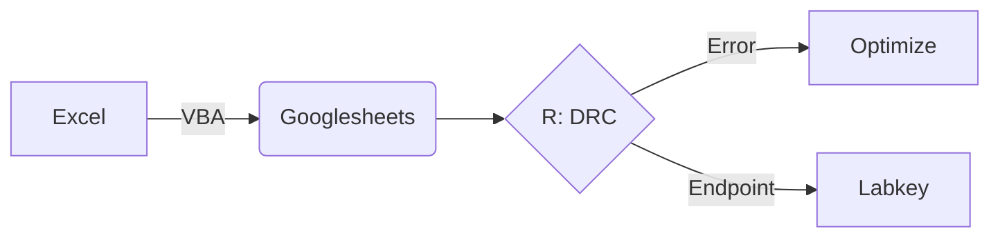
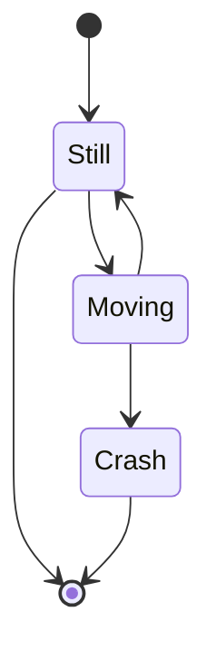
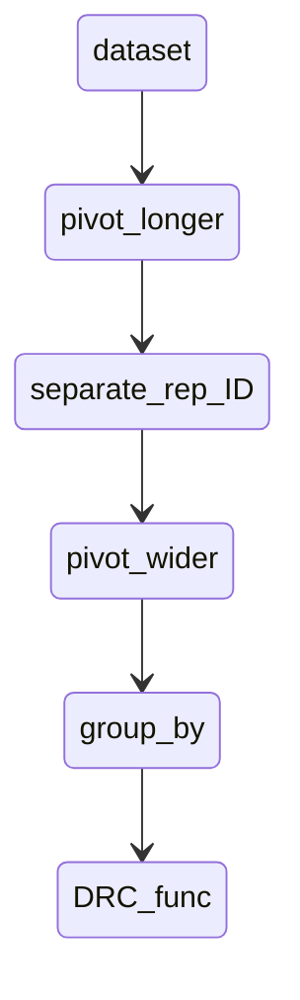

ELISA-R-DRC
===========


Evolving story for how to analyze data for endpoint titers using curve fitting. Logisitc curve regression is the preferred method. 4 or 5 parameter options best explained by the [Bio-RAD study note](https://geiselmed.dartmouth.edu/dartlab/wp-content/uploads/sites/22/2017/05/Bio-RadTechNote2861_principles_of_curve_fitting.pdf). Using the drc package is great for curve fitting. it is based on the work from the [paper](https://journals.plos.org/plosone/article?id=10.1371/journal.pone.0146021) and the [exhaustive book](https://www.routledge.com/Dose-Response-Analysis-Using-R/Ritz-Jensen-Gerhard-Streibig/p/book/9781032091815) To get the final data set this method will get around the need to preprocess with SQL as was demonstrated in the indexed rbind method.  But SQL is a very powerful language to accommodate datasets that may overwhelm the 





Using the packages:<br>
DRC: dose response curve fitting<br>
googlesheets4: cloud stored data<br>
tidyverse: for ubiquitous tool


```R
rm(list=ls())
library(googlesheets4)
library(drc)
library(Rlabkey)
suppressMessages(library(tidyverse))
library(dplyr)

###set vars
gg="XXX___GOOGLE_SHEET_SHARE_KEY"
xx=1 #sheet number

###Pull in the ELISA DATA from google sheet
x<-read_sheet(gg, range=paste("elisa", xx, sep = "_"))

##set background cutoff
ctof = x %>%
  group_by(visitid) %>%
  summarise(ctof=mean((NegSera_1+NegSera_2)/2)+ 3*sd((NegSera_1+NegSera_2)/2),
bck = mean((NegSera_1+NegSera_2)/2)) 
```

this will set up for the work to be done. Next stop is to create functions to accommodate 5 or 4 parameter fitting of the data. Then harvest the coefficients to use define X in the case of having Y. 


```R
##function with error handling 5pl
fundr<-function(x){
  tryCatch({ 
    fit = drm(variable~constant, data=x, fct=LL.5(), na.action=na.omit);
    
    data.frame( 
      'b'=as.numeric(coef(fit)["b:(Intercept)"]),
      'c'=as.numeric(coef(fit)["c:(Intercept)"]),
      'd'=as.numeric(coef(fit)["d:(Intercept)"]),
      'e'=as.numeric(coef(fit)["e:(Intercept)"]),
      'f'=as.numeric(coef(fit)["f:(Intercept)"]))
  },
  error=function(e) return(NA))
}

###function for 4PL
fundr<-function(x){
  fit = drm(variable~constant, data=x, fct=LL.4(), na.action=na.omit);
 ```

Determination of titer (x) from coefficients derived from 5PL curve fit line.


 ```R
  data.frame( 
    'b'=as.numeric(coef(fit)["b:(Intercept)"]),
    'c'=as.numeric(coef(fit)["c:(Intercept)"]),
    'd'=as.numeric(coef(fit)["d:(Intercept)"]),
    'e'=as.numeric(coef(fit)["e:(Intercept)"]))
  #titer=e*((-d+ctof)/(c-ctof))^(1/b))
  
}

```

Function to run DRC is created to determine endpoint titer from fit curve.  Next is to prepare the dataset to accommodate the DRC code. This is accommplished by setting the index column as a categorical variable to be able to get the code to work within the confines of the dataset. Bit of an accordian style where the data is in replicates and needs to be averaged. this is accomplished by the workflow: 


```R
###Endpoint Titer Determination
y = x %>% full_join(ctof, join_by(visitid)) %>%
  rowid_to_column(., "index") %>%
  dplyr::select(!c(NegSera_1,NegSera_2)) %>%
  pivot_longer(., cols = -c(index,assay, studyid, visitid, participantid, ctof, bck), 
                    names_to = 'titer', 
                    values_to = 'values') %>%
    separate(titer, c("titer",'numb'), "_") %>%
    pivot_wider(., names_from = "numb", values_from = "values", names_prefix = "rat") %>%
  mutate(variable=(rat1+rat2)/2-bck) %>%
    separate(titer, c(NA, "constant"), "T", convert = TRUE) %>%
  dplyr::select(!c(rat1, rat2, bck)) %>%
  group_by(index,visitid, participantid, ctof)  %>%
```
Invoking the fundr function for generating the curve:

based upon the 4 or 5 parameter logistic regression equation. 
using Wolfram alpha from years ago, i already have the y parameter and will need to solve the equation for x. Looks like this.

$$titer = {e* \Biggl[  {(c-d) \over (c-cuttoff)}^{1/f} {-1}} \]^{1/b}.$$

where:  <br>
b = symmetry factor <br>
c = estimated response at zero concentration <br>
d = estimated response at infiniate concentration <br>
e = mid range concentration <br>
f = slope factor 


```R
do(fundr(.)) %>%
  #5 param
  mutate(titer = e*(((c-d)/(c-ctof))^(1/f)-1)^(1/b)) %>%
  #4 param
  #mutate(titer=e*((-d+ctof)/(c-ctof))^(1/b)) #%>%
```

Gives us values to work with but interpolated data can cause some wild swings in values. using mutate we can clean up the obvious outliers and wrangle the data into a workable format

```R
mutate(titer = case_when(
    is.na(titer) ~ 100,
    is.nan(titer) ~100, 
    titer <100 ~100,
    titer > 450000 ~ 303030,
.default = as.numeric(titer)))
```
Finally bringing all of the data into one data frame is ideal to upload to Labkey server for final dataset and graphical outputs. 
```R
z<-data.frame(cbind(x, "titer"=y$titer))
```






touch README.md
git init
git add README.md
git commit -m "first commit"
git remote add origin https://github.com/aaronjwilson/ELISA-R-DRC.git
git push -u origin master
