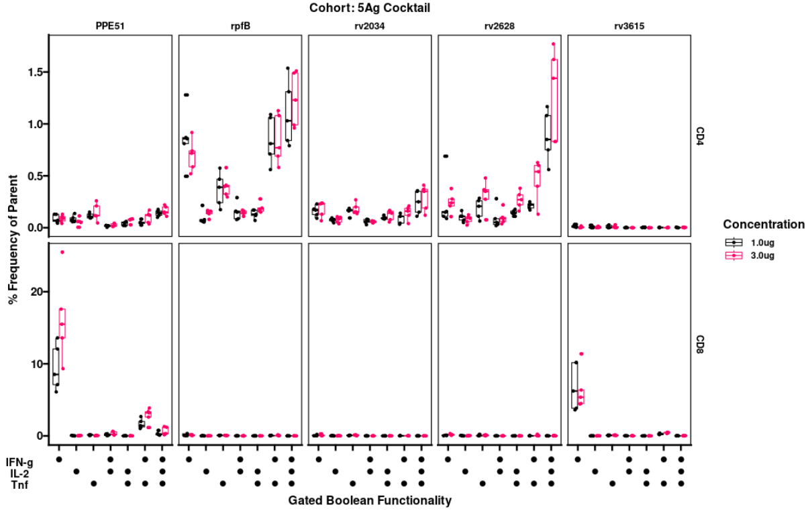

here is the ICS portion of the show. may need a step in here to show the melting/pivot longer of the data from flowjo output to columnized data for R work.
Want to make something that looks like this but using R instead of PESTLE/SPICE.

#final output graph representative will look like this. 

<p align="center">

</p>


```r
#https://stackoverflow.com/questions/28672705/ggplot-specify-position-of-vertical-segments-for-categorical-x-r
rm(list=ls())
sessionInfo()

library(tidyverse)
library(ggprism)
x3<-read.csv("tb_data")
```

#create background subtraction step that is often done within the PESTLE app. 
```r
x3mock<-x3[which(x3$antigen=="mock"),]
x3samp<-x3[which(x3$antigen!="mock"& x3$antigen!="stim"),]
```

from here we will merge the data and pipe the remainder of the steps
```r
x4<-merge(x3samp, x3mock, by=c("cohort","concentration","participantid", 
                                 "tissue", "cell", "bool")) %>%
  mutate(values=ifelse(values.x-values.y<=0,0, values.x-values.y)) %>%
  select(-c(antigen.y, values.x, values.y)) %>%
  mutate(concentration = factor(concentration, levels= c(NA,"1.0ug", "3.0ug")))%>%
```

#a series of mutations for aesthetics. creates an equivalency of an upsetter plot to be able to visualize the data in a format akin to SPICE outputs but without the need for a Mac computer. R will be able to accomplish the work agnostic to the platform OS. This is the SPICE portion.  will like to work on a shiny or quarto app to bring in the various selections to refine the data. 

```r
#is it possible to mutatae with a factor relevel and an ifelse in one step? seek out stackoverflow

mutate(bool2=
  ifelse(bool=="IFNg-IL2-TNFa+", 
" 
 
●",
ifelse(bool=="IFNg-IL2+TNFa-", 
" 
●
 ",  
  
ifelse(bool=="IFNg+IL2-TNFa-",
"●
 
 ",
ifelse(bool=="IFNg-IL2+TNFa+", 
" 
●
●",       
ifelse(bool=="IFNg+IL2-TNFa+", 
"●
 
●", 
ifelse(bool=="IFNg+IL2+TNFa-",
"●
●
 ",  
ifelse(bool=="IFNg+IL2+TNFa+",
"●
●
●", 
"x"))))))))%>%
       mutate(bool2=fct_relevel(factor(bool2),
"●
 
 ",
" 
●
 ",
" 
 
●",

"●
●
 ",

" 
●
●",
"●
 
●",                                
"●
●
●",
       )) %>%
arrange(bool2)
```

#create a function to define the graphs
```r
tb<- function(aa, bb) {
  

  ggplot(subset(x4, ( x4$tissue== aa &
                        match.fun(bb)(x4$cohort, "r5Ag"))),
          aes(bool2, values, colour=concentration ))+
           geom_boxplot()+
           geom_point(position=position_jitterdodge())+
           facet_grid(cell~antigen.x, scales = "free")+
```
#taking care with aesthetics
```r
           scale_color_discrete(labels=c("1.0ug", "3.0ug", "Naive"))+
           labs(x="Gated Boolean Functionality", y="% Frequency of Parent", 
                title=paste("M2023.1 Mouse TB Immunogenicity 02: ICS ", aa, sep=""),
                subtitle=paste("Cohort: ", ifelse(bb=="!=", "Individually Administered", "5Ag Cocktail"), sep=""),
```
#tag is an interesting addition to label the boolean axes. the location of the tag is determined in the theme() section below. like the upsetter points above the structure has to be written out to be functional on the graph. 

```r
                tag= 
"IFN-g
IL-2
Tnf",
                colour="Concentration")+
```
#ggprism has been one of the most helpful addtions to the pantheon of R packages as it allows the recreation of a Graphpad motif without having to go through the machinations of copy/pasta subgraphs that need updating with new data.  The functionally deterministic R code with execute with the addition of new data. 

   ```r
   theme_prism(base_size = 16)+
   scale_colour_prism(palette="colorblind_safe")+
  theme(
     panel.border = element_rect(colour = "black", fill = NA),
      legend.title = element_text(),
        legend.text = element_text(size = 12, face="bold", colour="black"),
         plot.tag = element_text(size = 14, face="bold", colour="black"),
        plot.tag.position = c(0.015, 0.065))
          
}
```
#not having to make additional graphs for each output is saved with the writting of a function to do it automagically for me. highly recommended. 

```r
tb("Spleen", "!=")
tb("Spleen", "==")
tb("Lung", "!=")
tb("Lung", "==")
```


